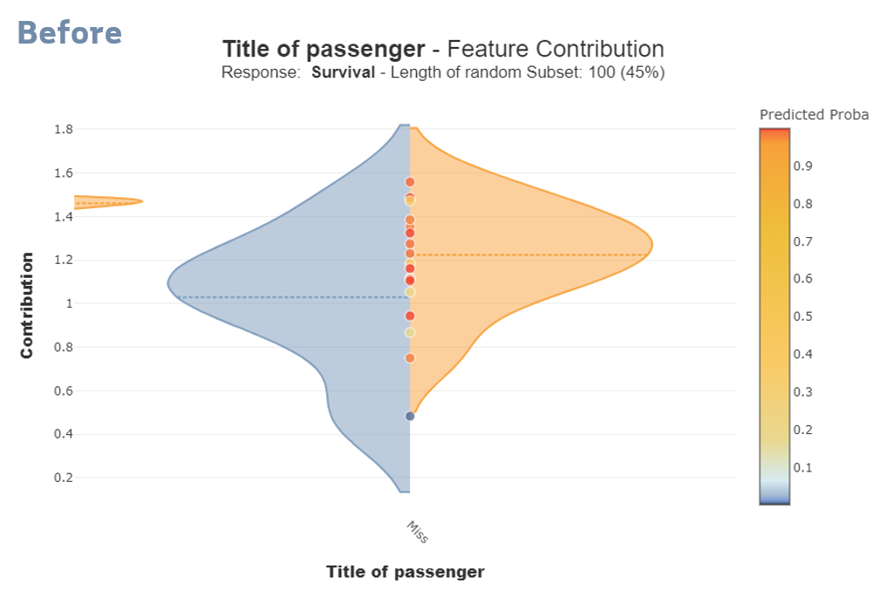
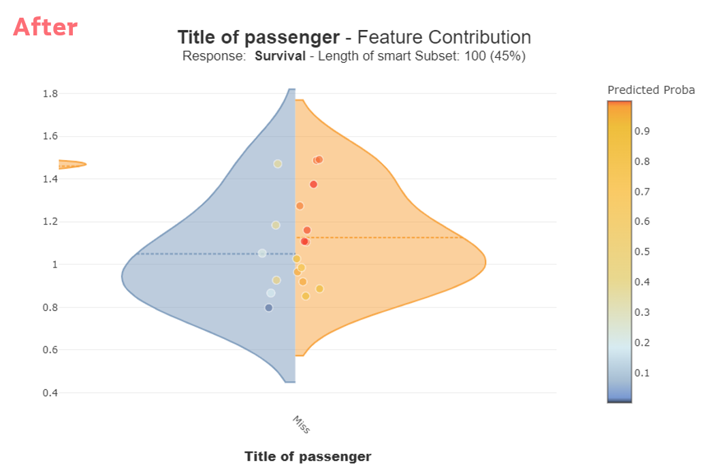
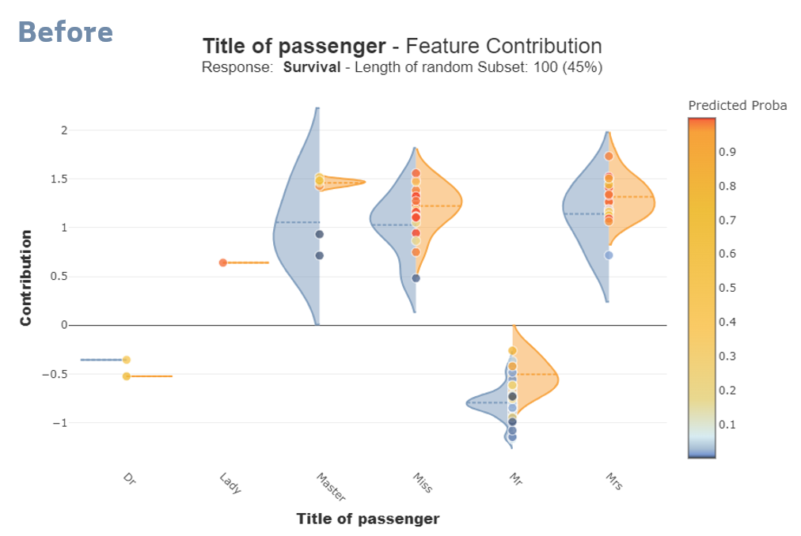
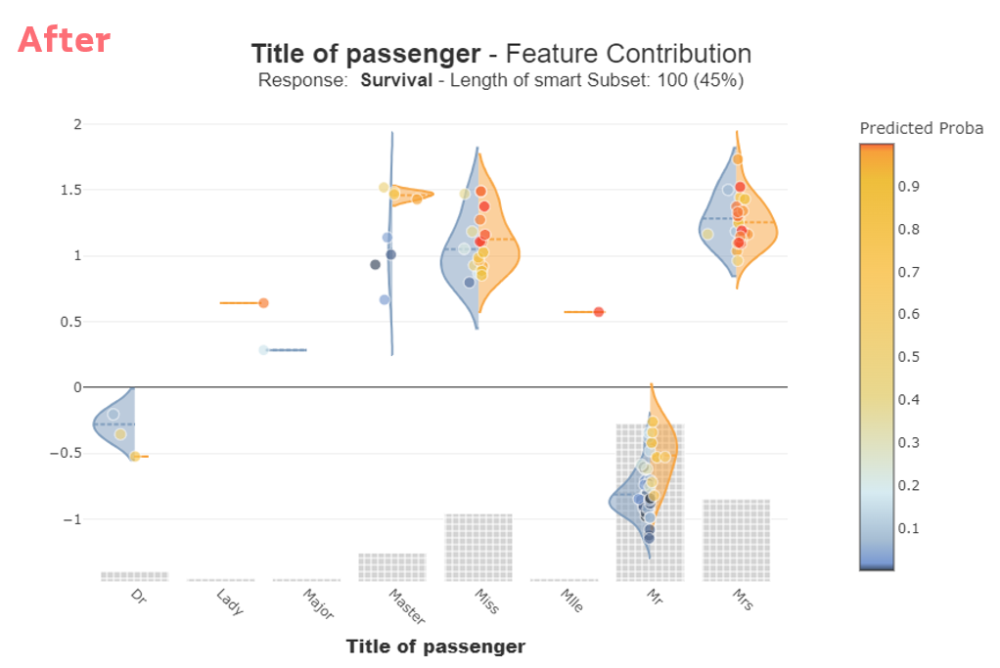
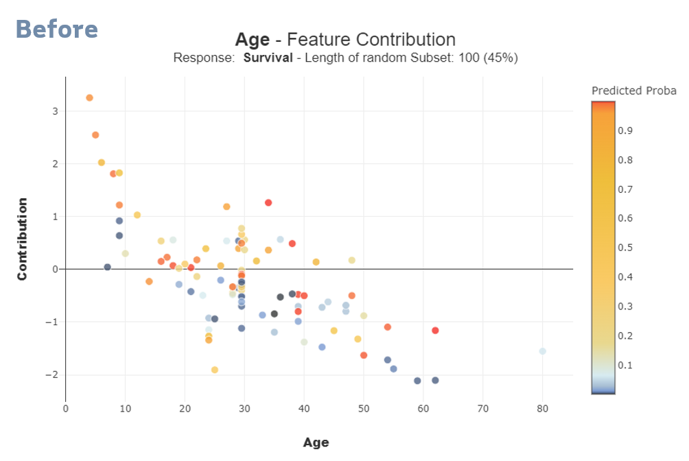
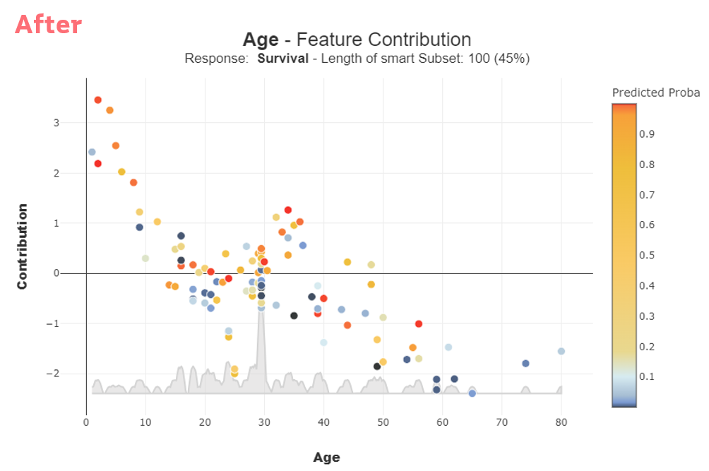

# Enhancing Shapash Contribution Plots with Jittering, Smart Selection, and Volume Representation

Shapash is a cutting-edge library for **machine learning interpretability**, offering diverse tools to facilitate understanding of model predictions. Three significant improvements in Shapash's **contribution plots** include **jittering points** on violin plots, **smart selection** for diverse class representation, and **volume representation** via curves and bars. These enhancements greatly enhance the **clarity** and **interpretability** of the plots, enabling users to derive deeper **insights** from their data.

## 1. Jittering Points on Violin Plot

**Violin plots** in Shapash display detailed distributions of **feature contributions**. However, overlapping points can obscure individual values. **Jittering** introduces controlled random noise to disperse points along the x-axis, preventing overlap and ensuring clearer visibility.

Here's the key snippet illustrating jittering:

```python
# Binning data into intervals and calculating the percentage of points in each interval
intervals = pd.cut(data, bins, duplicates="drop")
points_per_interval = intervals.value_counts()
total_points = len(data)
percentage_per_interval = (points_per_interval / total_points).sort_index().to_dict()

# Mapping those percentages to the original data points
percentage_series = intervals.map(percentage_per_interval).to_numpy()

# Creating jittered points
jitter = np.random.normal(mean, std, len(percentage_series))
if np.isnan(percentage_series).any():
    percentage_series.fill(1)

if side in ["negative", "positive"]:
    jitter = np.abs(jitter)

jitter = np.clip(jitter, clip_min, clip_max)

if side == "negative":
    jitter *= -1

jittered_points = numerical_features + np.clip(jitter * percentage_series, -0.5, 0.5)
```

### How It Works

1. **Binning Data and Calculating Percentages**: The data is segmented into intervals, and the percentage of points in each interval is computed.

2. **Mapping Percentages to Data Points**: The calculated percentages are mapped back to the original data points, creating `percentage_series`.

3. **Generating Jitter**: Random noise (`jitter`) is added to the data points to disperse them and avoid overlap.

4. **Handling Class Distinctions**: Depending on whether the side is **"negative"** or **"positive"**, adjustments ensure clear separation between classes.

### Summary

Jittering enhances the clarity of violin plots by dispersing points and making individual contributions more distinguishable. In classification tasks, it helps differentiate predictions for **class 0** (left side, negative values) and **class 1** (right side, positive values).

<div style="display: flex; justify-content: space-between;">
  
  
</div>

### Value Derived from Jittering

- **Enhanced Visibility**: Points are clearly separated, improving interpretability.
- **Clear Class Differentiation**: Facilitates understanding of class-specific contributions.
- **Visual Appeal**: Reduces clutter, enhancing aesthetic appeal of the plot.

## 2. Smart Selection for Diverse Class Representation

Shapash utilizes a **smart sampling strategy** to ensure a balanced representation of classes within the dataset. This approach involves clustering data points and sampling from each cluster, thereby avoiding biases towards specific classes and ensuring the selected points reflect the overall data distribution.

Here's the function handling smart selection:

```python
def _subset_sampling(
    self, selection=None, max_points=2000, col=None, col_value_count=0
):
    if col_value_count > 10:
        from sklearn.cluster import MiniBatchKMeans

        # Clustering data using MiniBatchKMeans
        kmeans = MiniBatchKMeans(n_clusters=10, random_state=0)
        kmeans.fit(data[[col]] if col else data)
        data["group"] = kmeans.predict(data)
    else:
        # Grouping data based on index or column value
        data["group"] = (
            data.index % 10 if col is None else data[col].apply(lambda x: int(x % 10))
        )

    idx_list = []
    for group in data["group"].unique():
        data_group = data[data["group"] == group]
        sample_size = min(len(data_group), max_points // 10)
        idx_list += data_group.sample(n=sample_size, random_state=0).index.to_list()
    return idx_list
```

### How It Works

The smart selection process begins by evaluating the **number of unique values** in a specified column (`col_value_count`). If this number is greater than 10, the data is clustered using the **MiniBatchKMeans** algorithm from the `sklearn` library. The algorithm creates 10 clusters, and each data point is assigned to one of these clusters.

If the number of unique values is 10 or fewer, a simpler approach is used: data points are grouped based on their index or a specific column value.

1. **Clustering with MiniBatchKMeans**:
- If there are more than 10 unique values, `MiniBatchKMeans` clusters the data into 10 groups.
- Each data point is assigned a cluster label stored in the "group" column.

2. **Grouping without Clustering**:
- If there are 10 or fewer unique values, data points are assigned to groups based on their index or a specific column value.

After grouping, the function samples points from each group to ensure that the final selection is diverse and representative of the entire dataset.

### Summary

This approach ensures that the selected sample for plotting features represents the dataset's diversity, enhancing the reliability and interpretability of Shapash's visualizations.

<div style="display: flex; justify-content: space-between;">
  
  
</div>

### Value Derived from Smart Selection

- **Balanced Class Representation**: Prevents dominance of any single class in visualizations.
- **Robust Interpretations**: Ensures insights drawn are representative of overall data trends.
- **Scalable Sampling**: Efficiently handles large datasets while maintaining sampling integrity.

## 3. Volume Representation via Curves and Bars

Shapash represents the **volume of data points** using **curves for continuous variables** and **bars for discrete variables**. This dual approach provides an **accurate visual summary** of how features are distributed across their range and how they contribute to the model's predictions.

Here's the code snippet illustrating volume representation:

```python
if feature_values.iloc[:, 0].dtype.kind in "biufc":
    from sklearn.neighbors import KernelDensity

    # Using Kernel Density Estimation for continuous variables
    kde = KernelDensity(
        bandwidth=(feature_values_array.max() - feature_values_array.min()) / 100,
        kernel="epanechnikov",
    ).fit(feature_values_array[:, None])
    xs = np.linspace(min(feature_values_array), max(feature_values_array), 1000)
    log_dens = kde.score_samples(xs[:, None])
    y_upper = np.exp(log_dens) * h / (np.max(np.exp(log_dens)) * 3) + contributions_min
    y_lower = np.full_like(y_upper, contributions_min)
else:
    # Counting values for discrete variables
    feature_values_counts = feature_values.value_counts()
    xs = feature_values_counts.index.get_level_values(0).sort_values()
    y_upper = (
        feature_values_counts.loc[xs] / feature_values_counts.sum()
    ).values.flatten() / 3 + contributions_min
    y_lower = np.full_like(y_upper, contributions_min)

# Creating the plot with either curve or bars
density_plot = go.Scatter(
    x=np.concatenate([pd.Series(xs), pd.Series(xs)[::-1]]),
    y=pd.concat([pd.Series(y_upper), pd.Series(y_lower)[::-1]]),
    fill="toself",
    hoverinfo="none",
    showlegend=False,
    line={"color": self._style_dict["contrib_distribution"]},
)
fig.add_trace(density_plot)
```

### How It Works

- **Continuous Variables**: Uses **Kernel Density Estimation (KDE)** to create smooth curves representing data distributions. Bandwidth is dynamically adjusted based on feature range.

- **Discrete Variables**: Constructs bars showing frequency distribution of discrete values, normalized to highlight relative proportions.

### Summary

This approach visually represents feature distributions comprehensively, aiding in understanding data volumes and their impacts on model predictions.

<div style="display: flex; justify-content: space-between;">
  
  
</div>
<div style="display: flex; justify-content: space-between;">
  
  
</div>

### Value Derived from Volume Representation

- **Clear Data Distribution**: Provides intuitive insights into feature distributions.
- **Impact Analysis**: Visualizes how features contribute to model predictions.
- **Enhanced Clarity**: Simplifies interpretation of complex data patterns.

## Conclusion

Enhancements in Shapash's contribution plots—jittering points, smart selection for diverse class representation, and volume representation via curves and bars—significantly improve the interpretability and usability of visualizations. These advancements empower users to gain deeper insights into model behaviors, facilitating informed decision-making in machine learning applications. By enhancing visualization clarity and representativeness, Shapash continues to be an invaluable tool for data scientists and analysts.
